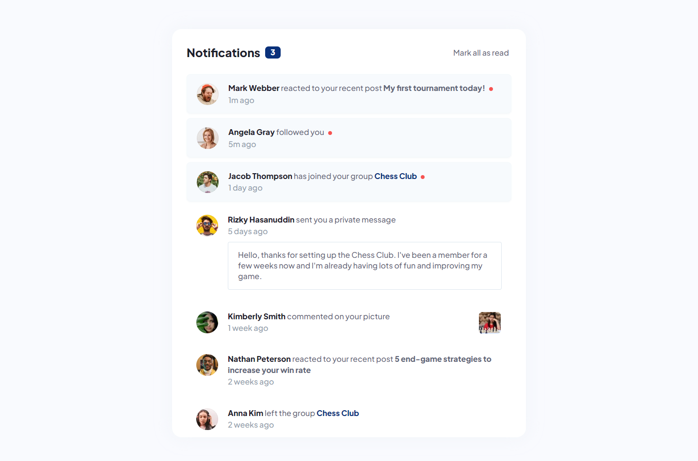

# Frontend Mentor - Notifications page solution

This is a solution to the [Notifications page challenge on Frontend Mentor](https://www.frontendmentor.io/challenges/notifications-page-DqK5QAmKbC). Frontend Mentor challenges help you improve your coding skills by building realistic projects. 

## Table of contents

- [Overview](#overview)
  - [The challenge](#the-challenge)
  - [Screenshot](#screenshot)
  - [Links](#links)
- [My process](#my-process)
  - [Built with](#built-with)
  - [What I learned](#what-i-learned)
  - [Continued development](#continued-development)
  - [Useful resources](#useful-resources)
- [Author](#author)

## Overview

### The challenge

Users should be able to:

- Distinguish between "unread" and "read" notifications
- Select "Mark all as read" to toggle the visual state of the unread notifications and set the number of unread messages to zero
- View the optimal layout for the interface depending on their device's screen size
- See hover and focus states for all interactive elements on the page

### Screenshot

### Links

- Solution URL: [Solution](https://www.frontendmentor.io/solutions/responsive-notifications-page-used-local-storage-for-saving-state-m-XLrUBysh)
- Live Site URL: [Live Site](https://imd94.github.io/notifications-page)

## My process

### Built with

- Semantic HTML5 markup
- CSS custom properties
- Flexbox
- Desktop-first workflow
- Plain javascript for visual state of the notifications

### What I learned

Although this project was not too CSS-heavy, it was good for refreshing the basics of CSS. The real challenge was to change the state of the notifications on click. Since I didn't use any database for this project, I took advantage of the browser's local storage feature to permanently store notification states and, of course, learned the basics of local storage.

### Continued development

- CSS flex
- Javascript dom manipulation

### Useful resources

- [Example resource 1](https://www.codehim.com/vanilla-javascript/javascript-dark-mode-toggle-with-local-storage) - This helped me to learn basics of local storage feature.
- [Example resource 2](https://www.w3schools.com/jsref/prop_win_localstorage.asp) - Another good source for learning basics of local storage

## Author

- Website - [imdesign94](https://imdesign94.com)
- Frontend Mentor - [@imd94](https://www.frontendmentor.io/profile/imd94)
- Twitter - [I do not have a twitter account yet](https://www.twitter.com)